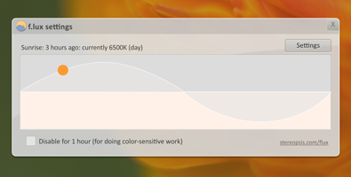

## [f.lux](https://justgetflux.com/)
> f.lux makes your computer screen look like the room you're in, all the time. When the sun sets, it makes your computer look like your indoor lights. In the morning, it makes things look like sunlight again.

> Make your eyes comfortable

---

## [Cmder](http://cmder.net/)
> Cmder is a software package created out of pure frustration over the absence of nice console emulators on Windows. It is based on amazing software, and spiced up with the Monokai color scheme and a custom prompt layout, looking sexy from the start.

---

